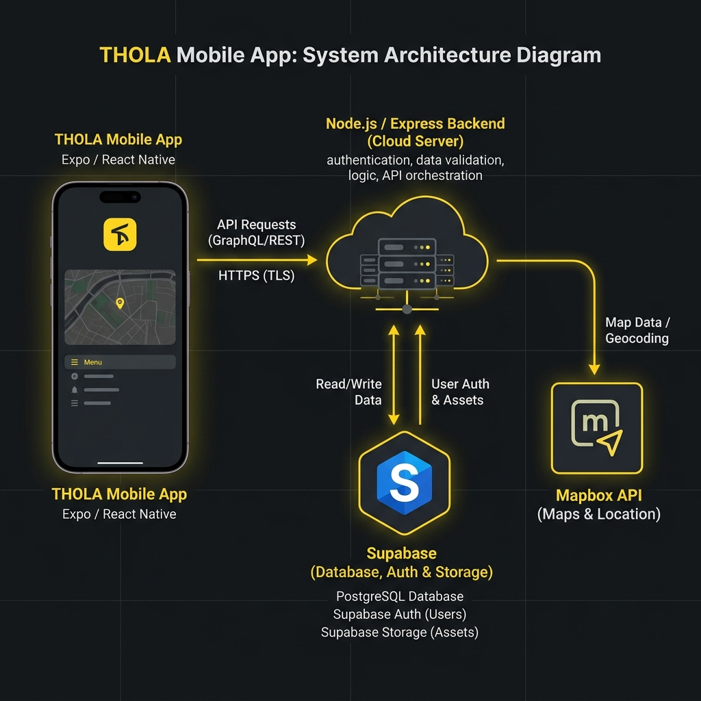
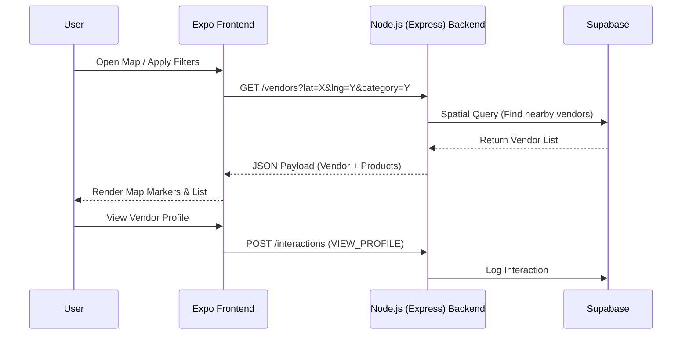
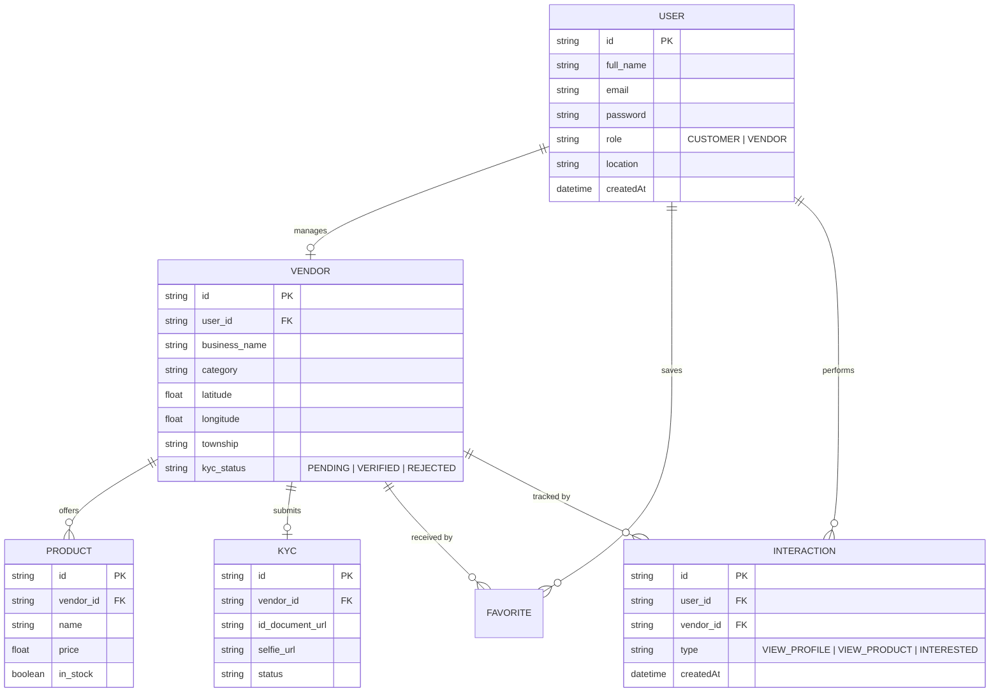
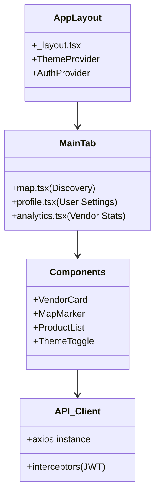

# Thola App: Project Evolution & System Documentation

This document outlines the significant changes, upgrades, and architectural shifts made to the Thola platform during the current development cycle.

---

## 🚀 Major Changes & Upgrades

### 1. Data Foundation: Supabase & Prisma
The platform is built on **Supabase**, providing a robust relational database with integrated authentication and storage.
- **ORM**: We utilize **Prisma ORM** for type-safe database access, automated migrations, and structured data management.
- **Features**: This setup supports complex spatial queries (PostGIS) for vendor discovery and handles high-concurrency interactions seamlessly.

### 2. Frontend Modernization: React PWA to Expo (React Native)
The frontend was migrated from a standard React web app to **Expo (React Native)**.
- **Benefit**: Native performance on iOS and Android while maintaining a high-quality web experience.
- **Navigation**: Implemented **Expo Router** for file-based routing and a seamless mobile UX.

### 3. UI/UX Overhaul: Premium Branding
- **Theme**: Replaced generic colors with a custom **Yellow & Grayscale** palette.
- **Design System**: Built using **React Native Paper** with custom modifications to achieve an "Uber-style" premium look.
- **Interactions**: Added smooth transitions, map-based filtering, and a dedicated analytics dashboard for vendors.

### 4. Feature Enhancements
- **KYC System**: Integrated a verification workflow for vendors (ID documents and selfie verification).
- **Map Integration**: Real-time vendor discovery using **Mapbox** with custom styling for clarity and brand alignment.
- **Analytics Engine**: Real-time tracking of profile views, product interests, and customer interactions.

---

## 🏗️ System Architecture

The following diagram illustrates the high-level interaction between the system components.



### 🧩 System Architecture (Code/Mermaid)
```mermaid
graph TD
    subgraph "Client Layer"
        User((User/Customer)) -->|Interacts| MobileApp[Expo App / Web]
        Vendor((Vendor)) -->|Manages| MobileApp
    end

    subgraph "Backend Layer (Node.js (Express))"
        MobileApp -->|REST API / JWT| API[Node.js (Express) Server]
        API -->|Prisma Client| ORM[Prisma ORM]
    end

    subgraph "Data Layer"
        ORM -->|SQL Queries| DB[(Supabase)]
        API -->|Cloud Storage| Storage[Supabase Storage]
    end

    subgraph "External Services"
        MobileApp -->|Map Tiles| Mapbox[Mapbox API]
        API -->|Emails| Mailer[SMTP/SendGrid]
    end
```

### 📟 System Architecture (ASCII Fallback)
```text
+----------------+       +-------------------+       +------------------+
|   Expo App     | ----> |  Node.js (Express) Backend  | ----> |  Supabase DB   |
| (Mobile / Web) | <---- |   (Prisma ORM)    | <---- | (Storage/Users)  |
+----------------+       +-------------------+       +------------------+
        |                         |
        v                         v
   +----------+             +------------+
   |  Mapbox  |             | Cloudinary |
   |  (Maps)  |             | (Images)   |
   +----------+             +------------+
```

---

## 🔄 Data Flow Diagrams

### Vendor Discovery Flow
How users find and interact with vendors nearby.




### 📟 Vendor Discovery Flow (ASCII Fallback)
```text
USER             FRONTEND             BACKEND             DATABASE
 |                  |                   |                    |
 |--- SEARCH ------>|                   |                    |
 |                  |--- GET /VENDORS ->|                    |
 |                  |                   |--- SPATIAL QUERY ->|
 |                  |                   |<---- VENDORS ------|
 |<-- SHOW MAP -----|                   |                    |
 |                  |                   |                    |
 |--- INTEREST ---->|                   |                    |
 |                  |--- LOG INTERACT ->|                    |
 |                  |                   |--- SAVE TO DB ---->|
```

---

## 📊 Database Schematic

The database is structured to support multi-role users, vendor verification (KYC), and customer interaction tracking.




### 📟 Database Schematic (ASCII Fallback)
```text
 [ USER ] 1 ------ 0..1 [ VENDOR ] 1 ------ 0..* [ PRODUCT ]
    |                      |
    |                      |------- 0..1 [ KYC ]
    |                      |
    |------- 0..* [ INTERACTION ] <----- (Tracks Customer Activity)
    |
    +------- 0..* [ FAVORITE ]
```

---

## 🏛️ Class & Entity Structure (Frontend)

The frontend follows a modular, feature-based architecture using Expo Router.



---

## 🛠️ Technical Upgrades & Fixes
- **Environment Parity**: Standardized `.env` handling across Backend and Frontend (Expo `EXPO_PUBLIC_` prefix).
- **Spatial Optimization**: Optimized database indexes for latitude/longitude lookups to ensure sub-100ms response times for map searches.
- **Theme Persistence**: Implemented `AsyncStorage` to ensure user theme preferences (Light/Dark/Custom Yellow) persist across app restarts.
- **Cross-Platform Compatibility**: Resolved `Platform` specific crashes when running the Expo app in a standard web browser.

---
*Last Updated: May 16, 2026*
